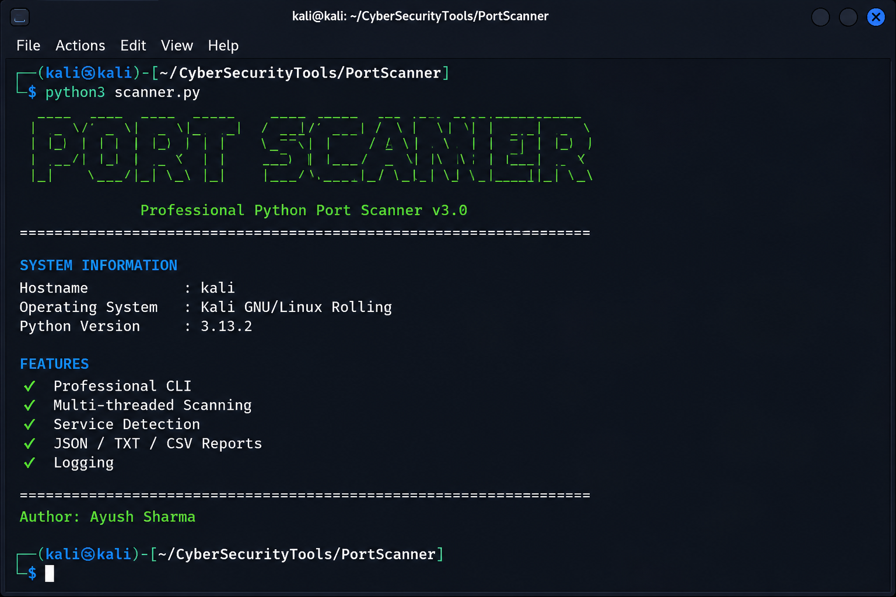
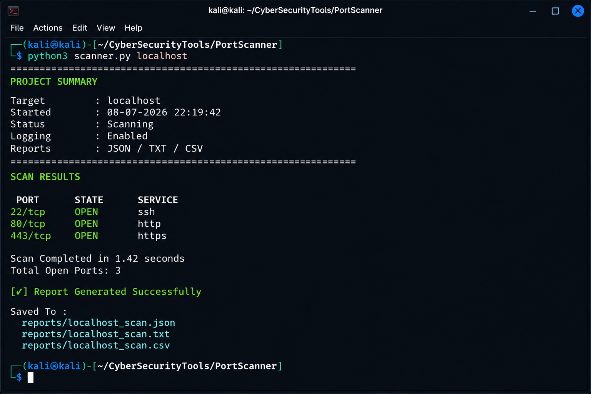
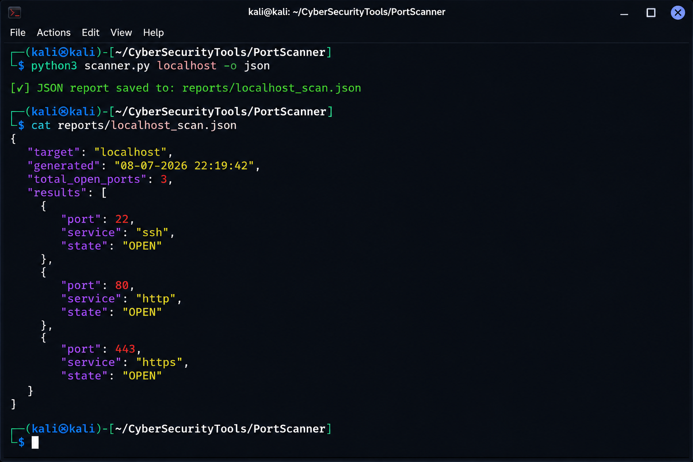
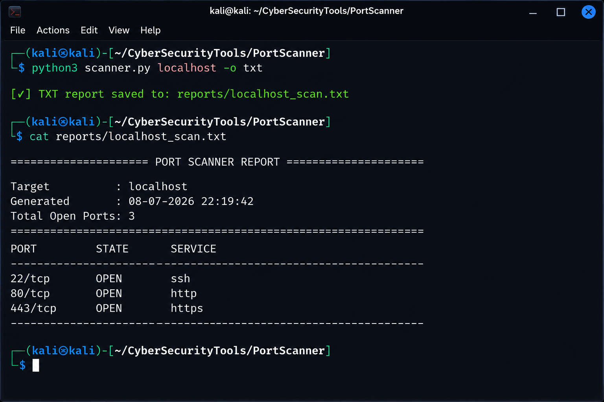
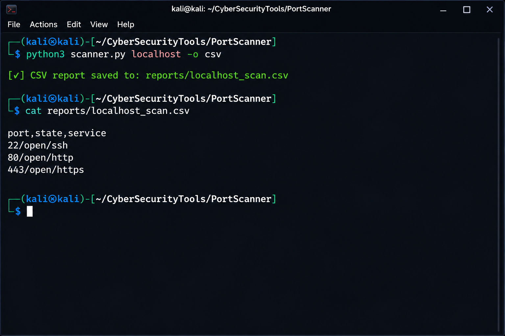

# 🚀 Python Port Scanner

A professional multi-threaded Python Port Scanner developed for cybersecurity learning and network security testing.

---

# ✨ Features

- 🚀 Fast Multi-threaded Port Scanning
- 🎨 Professional CLI Interface
- 📡 Service & Banner Detection
- 📄 JSON Report Generation
- 📄 TXT Report Generation
- 📄 CSV Report Generation
- 📝 Log File Generation
- ⚡ Clean and Easy-to-use Interface

---

# 📂 Project Structure

```
PortScanner/
│── scanner.py
│── banner.py
│── config.py
│── logger.py
│── report.py
│── utils.py
│── README.md
│
├── logs/
├── reports/
└── screenshots/
```

---

# 💻 Operating System

This project was developed and tested on:

- Kali Linux Rolling
- Python 3.13
- Linux Terminal

It may also work on:

- Ubuntu
- Debian
- Parrot OS

---

# 🛠 Technologies Used

- Python
- Threading
- Socket Programming
- Colorama
- PyFiglet
- tqdm
- Git
- GitHub

---

# 📥 Installation

## Clone Repository

```bash
git clone https://github.com/AyushSharma-arch/Port-Scanner.git
```

## Open Project Folder

```bash
cd Port-Scanner
```

## Install Required Packages

```bash
pip3 install colorama pyfiglet tqdm
```

## Run Tool

```bash
python3 scanner.py
```

---

# 📖 Usage

Basic Scan

```bash
python3 scanner.py
```

Generate JSON Report

```bash
python3 scanner.py localhost -o json
```

Generate TXT Report

```bash
python3 scanner.py localhost -o txt
```

Generate CSV Report

```bash
python3 scanner.py localhost -o csv
```

---

# 📸 Screenshots

## Banner



## Scan Output



## JSON Report



## TXT Report



## CSV Report



---

# 🔗 GitHub Repository

Repository Link:

https://github.com/AyushSharma-arch/Port-Scanner

---

# ⚠️ Disclaimer

This tool is developed only for educational purposes and authorized security testing.

Do not use it against systems without permission.

---

# 👨‍💻 Author

**Ayush Sharma**

GitHub:
https://github.com/AyushSharma-arch

---

# 📄 License

This project is licensed under the MIT License.